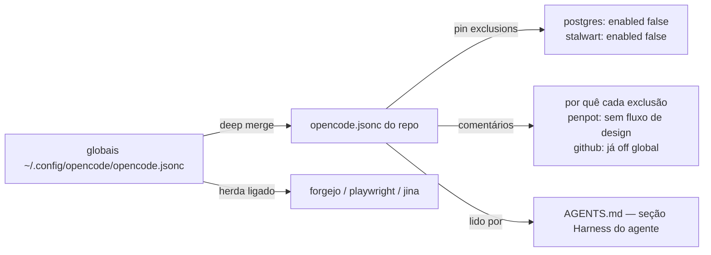

# Impl: MCPs de engenharia de software para os agentes da Iara

Status: aprovado
Atualizado em: 2026-08-18
Issue: #5
Intenção: docs/plans/mcp-engenharia.md
Appetite restante: herdado (~0,5 dia — item pequeno, sem UI)

## Leitura da intenção

- **Outcome:** contrato explícito e versionado de MCPs de engenharia do repo
  (`opencode.json(c)` na raiz) + seção curta "Harness do agente" no AGENTS.md;
  seleção dos globais que servem à Iara; nada teqo-específico; sem secret novo.
- **O que NÃO negociar:** exclusões registradas de forma visível (`postgres`,
  `penpot`, `stalwart`); AGENTS.md curto (não inventário); sem secret commitado;
  sem apontamento para infra do teqo.
- **O que reavaliar:** a "forma exata" (entradas com `enabled` vs seleção por
  comentário vs só doc) é delegada ao impl; hipótese de "provisioning de
  secrets em `.forgejo/worktree.env`" confirmada como N/A (nenhum MCP com token
  no conjunto — o arquivo só tem repo/worktrees root).

## Abordagem recomendada

**Opções consideradas:**

- **A — `opencode.jsonc` mínimo (pin só exclusions) + comentários + AGENTS.md**
- **B — `opencode.json` re-declarando as definições completas dos 3 habilitados + disables**
- **C — doc-only: sem arquivo de config, só AGENTS.md**

**Recomendação:** A — porque o contrato fica versionado e ativo (o arquivo
efetivamente desliga o que não serve), as definições dos habilitados continuam
com fonte única nos globais (sem fork que drift com mudança global), e os
comentários no arquivo registram o "porquê" das exclusões — o schema oficial
(`https://opencode.ai/config.json`) aceita comentários (`allowComments: true`) e
a forma mínima `{ "enabled": false }` para desligar MCP herdado de config
anterior (`required: [enabled]`, `additionalProperties: false`).

**Rejeitadas:** B porque duplica definições (comando do playwright, URL do
jina…) que mudam nos globais e a cópia do repo apodrece — e porque um dia alguém
edita só um dos dois lugares; C porque o contrato não é ativo (um MCP global
novo entraria em silêncio) nem versionado no sentido que o merge honra.

### Componentes / mudanças

- **`opencode.jsonc`** (novo, raiz): `$schema` + `mcp` com `postgres` e
  `stalwart` em `enabled: false`; comentários pt-BR registrando o porquê de cada
  exclusão (postgres: Iara não tem backend e o global aponta pro banco do teqo;
  stalwart: e-mail pessoal; penpot: sem fluxo de design, e é config de repo do
  teqo — nem chega a carregar; github: já off nos globais). Nada de
  `environment`/secrets/URLs. Playwright MCP fica habilitado — a regra "e2e só
  no CI" cobre o suite `test:e2e`, não o MCP de verificação visual em dev.
- **`AGENTS.md`**: nova seção `## Harness do agente` entre "Arquitetura do
  código" e "Workflow de trabalho" — skills (`.agents/skills/`, fonte
  `skills-lock.json`) + MCPs (contrato no `opencode.jsonc`: usados
  `forgejo`/`playwright`/`jina` dos globais, desligados `postgres`/`stalwart`,
  `penpot`/secrets do teqo nunca entram; `opencode.jsonc` é a fonte).
- **Migration:** N/A. **Access/Consent:** N/A (config, sem dados).
- **UI:** N/A — Impeccable A.
- `.forgejo/worktree.env`: **sem mudança** (sem MCP com token).

## Fases verificáveis

1. **Config** — criar `opencode.jsonc` na raiz (shape validado contra o schema
   oficial; comentários documentam exclusões).
2. **AGENTS.md** — seção "Harness do agente" curta.
3. **Gates** — `bun run gate` (config não é TS, mas valida que nada quebrou) +
   parse do JSONC; lembrar ao humano que config não é hot-reload — restart do
   opencode para valer; validação real acontece no próximo launch em worktree
   (escape: `OPENCODE_DISABLE_PROJECT_CONFIG=1`).
4. **Fechamento** — /simplify → capture-review-debts autônomo → PR `Closes #5`
   com auto-merge.

## Rabbit holes / Não escopo (engenharia)

- Re-declarar definições completas dos MCPs habilitados (drift com globais).
- Provisioning de secrets em worktrees / `.opencode/secrets/` (sem MCP com token).
- Mudar os globais (postgres do teqo lá é problema do teqo).
- Inventário completo de ferramentas no AGENTS.md (a config é a fonte).
- `opencode.json` duplicado ao lado do `.jsonc` (escolha um só).

## Riscos e mitigação

- **opencode local não aceitar a config** (versão divergente do schema): baixo —
  forma validada no schema publicado hoje e no skill `customize-opencode` da
  versão instalada; se falhar, escape `OPENCODE_DISABLE_PROJECT_CONFIG=1` e
  fallback barato: migrar comentários para o AGENTS.md e manter `.json` puro.
- **Alguém re-adicionar MCP excludente "para quando precisar"**: mitigado pelos
  comentários no próprio arquivo + menção na seção Harness do AGENTS.md.
- **Drift silencioso de global novo**: contrato do repo pin só exclusões; um MCP
  global novo entra — o humano revisa na hora de usá-lo e o arquivo é o lugar
  para registrar a decisão (custo barato, reversível).

## Aceite de engenharia

- [ ] Aceite de produto da intenção coberto: contrato versionado, exclusões
      registradas no arquivo, AGENTS.md curto, sem secret/infra do teqo
- [ ] Invariantes AGENTS/engineering-standards: sem secret commitado; copy pt-BR
      nos comentários; nada de servidor/produto novo
- [ ] Testes de domínio: N/A (config de ferramenta; sem path de dados/access)
