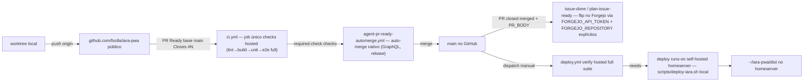

# Impl: Mover CI/PR do Forgejo Actions para o GitHub Actions — tracker de Issues permanece no Forgejo

Status: aprovado
Atualizado em: 2026-08-20
Issue: #17
Intenção: docs/plans/mover-ci-forgejo-para-github-actions-tracker-forgejo.md
Appetite restante: herdado (~2–3 dias eng; este impl é a Fase 1 — remoção dos arquivos do Forgejo é entrega sucessora)

## Leitura da intenção

- **Outcome:** código/PR/CI no GitHub Actions (`fsolla/iara-pwa` público) com a mesma cascata de verificações (lint → build → unit → e2e) em job único `checks`; tracker de Issues permanece no Forgejo por API (labels, claims, flips); deploy **manual** (`workflow_dispatch`) com `verify` hosted full → `deploy` no runner self-hosted do homeserver (sem SSH); rollup do job `checks` é o required check de `main` e o gate do merge automático — agora no GitHub; `bun run pr` mantém a semântica; runner do Forgejo desligado após o cutover.
- **O que NÃO negociar:** tracker no Forgejo (Issues/labels/claims/flips — nunca migra); estrutura de verificação de job único preservada (nada de matrix); e2e full no PR preservado; deploy NÃO volta a ser automático; nunca merge com CI vermelho; workstation livre da suíte; repo do Forgejo permanece o principal (GitHub é o espelho de código + superfície de PR/CI).
- **O que reavaliar:** a intenção sugere "API/`gh` equivalente" para `pr.mjs` e "auto-merge nativo ou safety net equivalente". Reavaliado contra o precedente teqo OPS71 (merged 2026-08-19, mesma migração): **`gh` não é usado** (filosofia plain-Node zero-dep do repo); os helpers novos são scripts Node stdlib sobre a REST+GraphQL do GitHub; auto-merge é o **nativo do GitHub** (GraphQL `enablePullRequestAutoMerge`, REBASE — o servidor só mergeia com required checks verdes; nada de poll/semáforo portado). O "sem branch protection server-side" do AGENTS.md morre com a migração: o rollup `checks` vira required check REAL no GitHub (`enforce_admins: true`).

## Abordagem recomendada

**Opções consideradas:**

- **A — Port do teqo OPS71 (mesma migração, merged 2026-08-19):** libs plain-Node (`github-api.mjs`, `github-pr-flow.mjs`, `github-branch-protection.mjs`) + CLIs (`github-pr-automerge.mjs`, `github-pr.mjs`, `configure-branch-protection.mjs`) + 5 workflows `.github/workflows/` + flip scripts com `PR_BODY` + runbook de cutover. Sem `gh`, sem poll.
- **B — `gh` CLI nos scripts/workflows:** binário novo em todas as máquinas + runner, contra a convenção zero-dep do repo — rejeitada (teqo OPS71 rejeitou o mesmo).
- **C — Poll-and-merge portado (`waitForChecks` do Forgejo) como mecanismo único:** reimplementa o semáforo que a intenção manda cortar; o bug do rollup do runner Forgejo (OPS64) não existe no GitHub com job único + required check real — rejeitada.
- **D — Deploy via artifact do hosted → download no homeserver:** plumbing de artifact que o teqo rejeitou; o build no homeserver espelha o teqo (deploy local, sem SSH) — rejeitada.
- **E — Deletar os arquivos do Forgejo já nesta entrega:** queima a via de rollback (repo Forgejo congelado no main pré-cutover mantém workflows vivos); teqo fez Fase 2 separada — rejeitada nesta entrega, vira Issue sucessora.
- **F — Auto-merge só para branch `agent/*` (igual `.forgejo/workflows/agent-pr-ready-automerge.yml`):** as branches de entrega da Iara são `<Code>-<slug>` para humano e agente igualmente (worktree compartilhado) — não há distinção por prefixo; o safety net arma auto-merge para **todo PR same-repo não-draft** (draft = veto do ator), como no teqo — a opção é descartada pela inexistência do prefixo.
- **G — Manter `--draft` no `bun run pr`:** regra do repo é "PR nunca draft"; teqo tornou a ausência estrutural (sem flag). `--draft` cai, falha loud se passado.

**Recomendação:** A + variante de F (auto-merge para todo PR same-repo não-draft) + G — porque cada peça reusa o molde existente (plain Node stdlib, libs puras unit-testadas, drift idempotente), o aceite da intenção exige exatamente esse desenho, e o precedente teqo foi validado ao vivo no mesmo mês (required-check literal, auto-merge nativo, flips via API, deploy verify→self-hosted).

**Rejeitadas:** B, C, D, E, e manter `--draft` (G, refutada). Hipótese da intenção "sem branch protection server-side" — **refinada**: no GitHub a proteção existe e é o gate final (required check `checks`, `enforce_admins: true`); o AGENTS.md é corrigido.

### Deltas Iara × teqo OPS71 (importantes)

1. **`FORGEJO_REPOSITORY` explícito nos workflows de flip.** No teqo, repo Forgejo e GitHub têm o mesmo nome (`fsolla/teqo`); na Iara são `amana/iara-pwa` (tracker) vs `fsolla/iara-pwa` (GitHub). Sem a variável, `forgejo-api.mjs` resolveria `GITHUB_REPOSITORY` (setado pelo Actions) → flip no repo errado → 404. Todos os workflows que falam com o tracker setam `FORGEJO_REPOSITORY=amana/iara-pwa` + `FORGEJO_API_URL=https://git.solla.dev/api/v1` + `FORGEJO_API_TOKEN` (o `GITHUB_SERVER_URL` do GitHub resolveria a base errada — mesma armadilha que o teqo documentou).
2. **`bun` no CI, sem serviços.** Iara é SPA: ci.yml sem Postgres/services; `oven-sh/setup-bun@v2`; e2e com `bunx playwright install --with-deps chromium` (hosted ubuntu precisa das deps de sistema; a workstation não tinha). Flip workflows usam `setup-node` (scripts plain-Node, sem install).
3. **Sem convenção `cursor/*`.** Draft = veto em qualquer caso (`github-pr-flow.mjs` sem o caminho mark-ready do teqo — a Iara não cria draft por nenhum fluxo).
4. **`pr.mjs` arma o auto-merge direto.** O `bun run pr -- --automerge` local cria o PR E arma o auto-merge nativo via GraphQL (o PAT do usuário tem direito); o safety net cobre PRs esquecidos. Semântica de "cria e mergea quando os checks passarem" preservada — o "quando" é garantido pelo servidor, não por poll.
5. **Deploy é site estático.** `scripts/deploy-iara.sh`: HEAD guard (`git ls-remote` no GitHub público) → flock → workspace fetch no SHA → marker `~/iara-pwa/.deployed-sha` (idempotência — dispatch duplicado é no-op, no molde do guard do teqo) → `bun install` + `bun run build` → `rsync -a --delete` do dist para `~/iara-pwa/dist/` (mesmo destino do rsync via SSH de hoje, agora local). Sem docker/migrate.
6. **`configure-branch-protection.mjs` com literal `checks`.** Verificado ao vivo no teqo (PR #742): o GitHub casa o required check pelo nome do CHECK-RUN (o job `checks`), não pelo display `CI / checks`. O literal `checks` é pinado no spec unit + verificado no primeiro PR (fail-closed: literal errado = PR não mergea, visível, nunca merge vermelho).

### Componentes / mudanças

- **`.github/workflows/ci.yml`** (novo): port do `.forgejo/workflows/ci.yml` job `checks` — `pull_request: branches: [main]`; `runs-on: ubuntu-latest`; `timeout-minutes: 30`; `permissions: contents: read`; `concurrency: { group: ci-pr-${{ github.head_ref }}, cancel-in-progress: true }`; `if:` same-repo no job (repo público — fork não queima minutes). Steps: checkout → setup-bun → `bun install --frozen-lockfile` → lint → build → test:unit → `bunx playwright install --with-deps chromium` → e2e. Sem job `deploy` (ver deploy.yml) e sem push-main (sem verificador de main — decisão do gate).
- **`.github/workflows/deploy.yml`** (novo): `workflow_dispatch` (sem inputs, ref main). Job `verify` (ubuntu-latest): suíte **full** sem skips (lint → build → unit → e2e). Job `deploy` (`needs: [verify]`, `runs-on: [self-hosted, homeserver]`): checkout → `bash scripts/deploy-iara.sh "$GITHUB_SHA"`.
- **`.github/workflows/issue-done-on-main-merge.yml`** (novo): `pull_request: types: [closed]`; `if:` merged && base main && **same-repo** (guarda RCE — checkout de fork + PAT = RCE); env `FORGEJO_API_TOKEN` (secret), `FORGEJO_API_URL`, `FORGEJO_REPOSITORY`, `PR_BODY` (do evento); setup-node; `node scripts/forgejo-issue-transition.mjs --pr <N>`.
- **`.github/workflows/plan-issue-ready-on-main-merge.yml`** (novo): idem + `if:` com `Related #` no body (e same-repo).
- **`.github/workflows/agent-pr-ready-automerge.yml`** (novo): `pull_request: [opened, reopened, synchronize, ready_for_review, converted_to_draft]`; `if:` open && same-repo; `permissions: { contents: write, pull-requests: write }`; `GITHUB_TOKEN: ${{ github.token }}` explícito; `node scripts/github-pr-automerge.mjs --pr <N>`.
- **`scripts/lib/github-api.mjs`** (novo, plain Node): REST+GraphQL zero-dep (molde do `forgejo-api.mjs`), auth `GITHUB_TOKEN`, base `GITHUB_API_URL`/default `https://api.github.com`, repo `GITHUB_REPOSITORY`/default `fsolla/iara-pwa`; retry com backoff (política do teqo: 5xx retry só GET; 4xx nunca); shapes normalizados (`pr.state` OPEN|CLOSED, `pr.draft`, `pr.nodeId`); endpoints: `getPullRequest`, `markPullRequestReady`, `createPullRequest` (nunca draft), `enableAutoMerge` (GraphQL REBASE), `getBranchProtection` (normalizado p/ drift), `updateBranchProtection`, `updateRepository`.
- **`scripts/lib/github-pr-flow.mjs`** (novo, puro): `decideAutomergeAction(pr)` → skip (inexistente/merged/não-open/base≠main/**draft-veto**) | enable-auto-merge. Pin OPS57 (draft = veto) e OPS64 (nunca merge vermelho — estrutural no GitHub) no jeito GitHub. Unit-testado.
- **`scripts/github-pr-automerge.mjs`** (novo, plain Node): CLI do workflow — lê PR, `decideAutomergeAction`, arma auto-merge no `node_id`; erro do GraphQL → exit 1 (job vermelho, visível); idempotente.
- **`scripts/pr.mjs`** (reescrito): `bun run pr -- --head <b> [--title <t>] [--body "…"] [--automerge]` contra a REST do GitHub (GITHUB_TOKEN env; `loadProjectEnv` + `GITHUB_REPOSITORY` do env file). `--automerge` arma auto-merge nativo (GraphQL) após criar. `--draft` removido (falha loud). Sem poll — o servidor mergea quando o required check verde.
- **`scripts/lib/github-branch-protection.mjs`** (novo, puro): `REQUIRED_CHECK_CONTEXT = 'checks'` (literal verificado no teqo), `DESIRED_RULE` (strict=false, 0 reviews, `enforce_admins: true`, sem restrictions), `ruleMatches`/`planBranchProtectionRule` (create|update|noop). Unit-testado.
- **`scripts/configure-branch-protection.mjs`** (novo): idempotente (read → plan → apply → verify), `--dry-run`; adiciona `bun run configure:branch-protection`.
- **`scripts/forgejo-issue-transition.mjs`** (editado): aceita `PR_BODY` env (o corpo do PR agora vem do evento GitHub; sem PR_BODY mantém o fallback da API do Forgejo, dormente); **falha loud** (exit 1 se qualquer flip falhar — I10 absorvida: "o flip novo roda no GitHub com token apropriado e falha loud"); comentário do flip atualizado ("deploy manual via workflow_dispatch").
- **`scripts/agent-promote-related-on-merge.mjs`** (editado): `PR_BODY` já suportado (usado pelos workflows novos; sem PR_BODY mantém a leitura via API do Forgejo).
- **`scripts/deploy-iara.sh`** (novo): ver Opção 5 acima. Env defaults: `IARA_REPO_URL=https://github.com/fsolla/iara-pwa.git`, `WORKSPACE_DIR=$HOME/iara-deploy`, `SERVE_DIR=$HOME/iara-pwa/dist`, `DEPLOY_LOCK=/tmp/iara-deploy.lock`.
- **`scripts/lib/load-project-env.mjs` + `.forgejo/worktree.env`**: `GITHUB_REPOSITORY=fsolla/iara-pwa` no env file (commitado, sem segredos) e carregado no process.env como `FORGEJO_REPOSITORY` (default local p/ os scripts GitHub).
- **`package.json`**: `pr:automerge` → `scripts/github-pr-automerge.mjs`; novo `configure:branch-protection` → `scripts/configure-branch-protection.mjs`. `issue:transition` permanece (mesmo arquivo).
- **`opencode.jsonc`**: comentário do MCP `github` atualizado (fluxo de PR/CI volta a ser GitHub, mas via scripts `bun run pr` — MCP continua desligado; o `forgejo` MCP permanece, é o tracker).
- **`AGENTS.md` + skills (`work-issue`/execution-pipeline)**: seção CI/Workflow reescrita para GitHub (workflows, auto-merge nativo, required check `checks`, deploy manual, branch protection REAL — corrige o invariante "sem branch protection"); comandos `bun run pr`/`worktree` mantidos (semântica preservada); passo do cutover nomeado.
- **`docs/ops/deploy-github-runbook.md`** (novo): runbook do cutover na ordem + rollback + secrets + runners (ver Fases).

### Migration / Access / UI

- **Migration:** sem migration (nenhum schema).
- **Access / Consent:** nenhum.
- **UI:** Impeccable N/A.

## Fases verificáveis

1. **Libs + scripts base** — `github-api.mjs`, `github-pr-flow.mjs` (puro), `github-branch-protection.mjs` (puro), `pr.mjs` reescrito, `github-pr-automerge.mjs`, `configure-branch-protection.mjs`, `deploy-iara.sh`, flips com PR_BODY, `load-project-env`/env file + specs unit novas (`tests/unit/github-api.test.ts`, `github-pr-flow.test.ts`, `github-branch-protection.test.ts`, molde bun:test do `ws.test.ts`). Gate: `bun run test:unit`.
2. **Workflows** — `.github/workflows/*` (5). Nada do `.forgejo/workflows/` é tocado nesta fase. Gate: `bun run gate` + review YAML.
3. **Docs/skills/runbook** — AGENTS.md, skills, `docs/ops/deploy-github-runbook.md`, opencode.jsonc.
4. **Gates finais + entrega** — `bun run gate`; PR via `bun run pr -- --automerge` (semântica nova) com `Closes #17`; CI verde no GitHub → auto-merge → flips da #17 (validação ao vivo do fluxo no merge do próprio OPS1) → deploy via dispatch manual quando o runner do homeserver estiver pronto. **Passos manuais do cutover listados para o humano** (ordem do teqo OPS71): (a) remotes (`origin` → GitHub; Forgejo secundário); (b) PAT `GITHUB_TOKEN` local + secret `FORGEJO_API_TOKEN` no GitHub + `allow_auto_merge` no repo; (c) `bun run configure:branch-protection`; (d) desligar o runner do Forgejo após validação; (e) runner self-hosted do GitHub no homeserver + `bun` no homeserver (deploy; não bloqueia PRs); (f) push → PR → CI → merge. O PR em si não depende de (d)/(e).

## Fase 2 — entrega sucessora (pós-validação)

Registrada no fechamento desta Issue (capture-review-debts, autônomo): remove `.forgejo/workflows/*`, `scripts/forgejo-pr-automerge.mjs` e docs residuais do fluxo Forgejo. Critério de entrada: um ciclo completo validado no GitHub (PR → CI → auto-merge → flip → deploy manual).

## Rabbit holes / Não escopo (engenharia)

- Portar `waitForChecks`/statuses para o GitHub — não há; auto-merge nativo (servidor).
- Re-engenharia do deploy além do necessário — só a origem do clone, o modo de invocação (local, sem SSH) e o destino final mudam; rsync `--delete` preservado.
- Sincronizar o repo Forgejo com main — congelado no cutover (decidido; tracker intacto por API).
- Migrar Issues/labels/claims — anti-goal explícito.
- e2e local afetado / scoping do CI (teqo OPS72) — fora de escopo (e2e full preservado).
- Upgrade do Forgejo / infra do homeserver — decisões separadas.
- Secrets (`FORGEJO_API_TOKEN` no GitHub, `GITHUB_TOKEN` PAT local, runner) — passos manuais documentados no runbook, não código.

## Riscos e mitigação

- **Literal do required check:** `checks` (nome do check-run/job), pinado no spec + verificado ao vivo no primeiro PR (teqo: validado no PR #742). Errado → PRs não mergeam (fail-closed, visível) — nunca merge sem verificação.
- **GITHUB_TOKEN vs repo:** `fsolla/iara-pwa` é repo de usuário — o token built-in do Actions com `pull-requests`+`contents` write arma auto-merge normalmente (o bloqueio de repo de org era específico do Forgejo — I10, absorvida; flip usa `FORGEJO_API_TOKEN`, nunca o GITHUB_TOKEN).
- **Flip no repo errado (deltas #1):** `FORGEJO_REPOSITORY` + `FORGEJO_API_URL` explícitos em TODOS os workflows de flip + fail-loud (exit 1) — o 403/404 da era I10 não repete em silêncio.
- **Fork PR (repo público):** `if:` same-repo em todos os jobs que usam checkout/secrets (guarda RCE preservada do teqo).
- **Runner do homeserver ainda não instalado / sem bun:** deploy indisponível até o passo manual (e); PRs mergeam normalmente (CI hosted não depende dele); o PR deste item não publica nada sozinho (dispatch manual).
- **Runner do Forgejo ligado durante a transição:** com o repo congelado, o ci.yml antigo rodaria no push do main congelado... não há push novo (origin vira GitHub) — runner desligado no passo (d), reversível.
- **`gate` local vs `origin/main`:** sem o passo (a) dos remotes, o diff local compara contra o Forgejo defasado — passo (a) é o PRIMEIRO do cutover e o runbook avisa (comando exato).
- **Deploy duplicado (dispatch repetido do mesmo SHA):** marker `~/.deployed-sha` + HEAD guard — no-op, molde do teqo.

## Aceite de engenharia

- [ ] Aceite de produto da intenção ainda coberto (CI/PR GitHub, tracker Forgejo por API, deploy manual verify→self-hosted, rollup `checks` required check, `bun run pr` com semântica preservada)
- [ ] Cutover em duas fases: sistema GitHub criado e validado ao vivo primeiro; arquivos do Forgejo preservados nesta entrega (rollback), remoção em entrega sucessora
- [ ] Invariantes AGENTS/engineering-brief (plain Node stdlib nos helpers de CI; zero-dep nos workflows; sem migration; tracker intocado)
- [ ] Testes de domínio previstos: github-api (normalização/endpoints), github-pr-flow (decisões de skip/auto-merge — pins OPS57/OPS64), github-branch-protection (regra desejada + drift)
