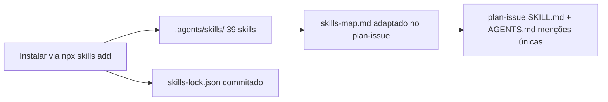

# Impl: Skills de engenharia de software para os agentes da Iara

Status: aprovado
Atualizado em: 2026-08-18
Issue: #4
Intenção: docs/plans/skills-engenharia.md
Appetite restante: herdado (~0,5–1 dia; pack instalado + lockfile + integração no plan-issue)

## Leitura da intenção

- **Outcome:** os agentes da Iara têm o pack de engenharia (addyosmani 24 + subset wondelai) instalado em `.agents/skills/` com `skills-lock.json` commitado, e o `plan-issue` absorve os princípios dessas skills em silêncio via `skills-map.md` — sem depender do repo do teqo como referência viva.
- **O que NÃO negociar:** as 5 skills de fluxo custom continuam como estão (`code-simplification` inclusive — não instalar duplicado); nada de produto/marketing do wondelai; lockfile commitado = instalação reprodutível; plan-issue não vira tour de skills; menção única no AGENTS.md (sem inventário).
- **O que reavaliar:** o mecanismo de instalação era hipótese aberta (CLI `npx skills` vs cópia do teqo) — validei na exploração; o teqo `skills-lock.json` está **desatualizado** (hashes não batem com o upstream atual nem com o instalado local), então a cópia do teqo está descartada por hash e por conteúdo (arquivos do teqo são adaptados à convenção deles).

## Abordagem recomendada

**Opções consideradas:** A) `npx skills add` (vercel-labs/skills) | B) cópia de `~/Code/teqo/.agents/skills/`
**Recomendação:** A — CLI gera `skills-lock.json` com hashes **frescos** do upstream atual, e o `experimental_install` restaura a partir do lockfile (máquina nova). O formato do lockfile é idêntico ao do teqo (mesma tool). A cópia do teqo traria conteúdo adaptado à convenção deles + hashes stale (verificado: 0/8 skills batem com o lockfile deles).
**Rejeitadas:** B porque o teqo editou SKILL.md para a convenção deles (não queremos herdar essas edições) e o lockfile deles não reflete o conteúdo instalado (hashes divergem do upstream e do local) — copiar seria propagar um rastro quebrado.

### Componentes / mudanças

- **`.agents/skills/` (39 novas skills):** 23 do `addyosmani/agent-skills` (24 menos `code-simplification`, que já existe custom e é **byte-idêntica** ao upstream — verificado por diff) + 16 do `wondelai/skills` (clean-code, clean-architecture, system-design, ddia-systems, domain-driven-design, pragmatic-programmer, refactoring-patterns, refactoring-ui, remove-technical-debt, software-design-philosophy, high-perf-browser, web-typography, ux-heuristics, microinteractions, working-with-legacy-code, team-topologies — todas existem no repo, verificadas; nenhuma é produto/marketing). Instalação: `npx skills add <repo> -s <lista> -a opencode -y --copy` → só toca `.agents/skills/` + `skills-lock.json` (verificado em sandbox: `-a opencode` não espalha os ~50 dirs de agentes do default `*`).
- **`skills-lock.json` (raiz):** gerado pelo CLI na instalação, commitado. Fonte de verdade de proveniência (source/skillPath/hash). `npx skills experimental_install -y` restaura/reescreve (fetch do HEAD upstream; não é pin imutável — hashes são integridade, upgrades são deliberados via `skills update`).
- **`.agents/skills/plan-issue/skills-map.md`:** adaptado do teqo para a Iara — remove referências teqo/GitHub (`ui-draft-html`, `data-presentation.md`, conventions de payload/Consent/access), mantém só skills presentes no pack da Iara + `decision-quality.md` (já existe em `work-issue`), `pnpm`→`bun`, GitHub→Forgejo. O que o plan-issue absorve: spec-driven, planning-and-task-breakdown, incremental-implementation, doubt-driven-development, DDD/clean-architecture sob demanda; build/review ficam para `work-issue`.
- **`.agents/skills/plan-issue/SKILL.md`:** uma linha no bloco "Shaping (não tour)" → "aplique [skills-map.md](skills-map.md) em silêncio". Sem mais edits.
- **`AGENTS.md`:** menção única (uma linha na seção do workflow): pack de engenharia em `.agents/skills/` + `skills-lock.json` como fonte de verdade; upgrade via `skills update`.
- **Migration:** não se aplica. **Access/Consent:** não se aplica. **UI:** não se aplica (Impeccable A — sem UI).

### Dados → forma

Não se aplica — item de infra de fluxo de agente, sem superfície de dados.

## Fases verificáveis

1. **Tracer — instalar o pack:** 2× `npx skills add` (addyosmani com `-s` excluindo `code-simplification`; wondelai com as 16) → conferir `.agents/skills/` com 39 pastas novas, 5 skills de fluxo intocadas (`git status` não as lista), `skills-lock.json` com 39 entradas.
2. **Integração:** `skills-map.md` + linha no `plan-issue/SKILL.md` + menção única no `AGENTS.md`.
3. **Gates:** `bun run gate` (lint + build/typecheck); e2e não roda local (decisão do repo); push via PR `Closes #4` com auto-merge.

## Rabbit holes / Não escopo (engenharia)

- **Copiar o lockfile ou as skills do teqo** — hashes stale + conteúdo adaptado a outra convenção. **Corte:** instalar do upstream.
- **Instalar com `-a '*'`** — espalha skills por ~50 diretórios de agentes. **Corte:** `-a opencode`.
- **Instalar `code-simplification` do pack** — sobrescreveria a skill custom de fluxo. **Corte:** `-s` sem ela; o conteúdo é idêntico (diff = 0).
- **Adaptar/editar SKILL.md dos packs** — quebra rastreio do lockfile e vira projeto de escrita. **Corte:** copiar como vem; melhoria = débito separado com `depends` nesta Issue.
- **Inventário das 44 skills no AGENTS.md** — incha e desatualiza. **Corte:** menção única + lockfile como fonte de verdade.

## Riscos e mitigação

- **Upstream muda entre instalações** (`experimental_install` busca HEAD, não pin de commit) → conteúdo fica commitado no repo; divergência aparece como diff no re-sync e o lockfile é reescrito. Mitigação: upgrades só via `skills update` deliberado, revisado como qualquer PR.
- **Contexto de sessão inflado** (39 skills novas no `available_skills` do opencode) → tradeoff aceito (mesmo padrão do teqo); `skills-map.md` impede o plan-issue de virar tour.
- **Network no install** → ação única de dev (não CI, não runtime).
- **Formatação/line endings divergentes nos SKILL.md** → trivial, não afeta gate (lint/build não tocam `.agents/skills/`).

## Aceite de engenharia

- [ ] Aceite de produto da intenção ainda coberto (pack + lockfile + skills-map + menções únicas)
- [ ] Invariantes AGENTS: 5 skills de fluxo intocadas; copy pt-BR/identificadores em inglês; sem secrets
- [ ] Testes de domínio: não se aplica (sem código de produto); gate lint+build como verificação
