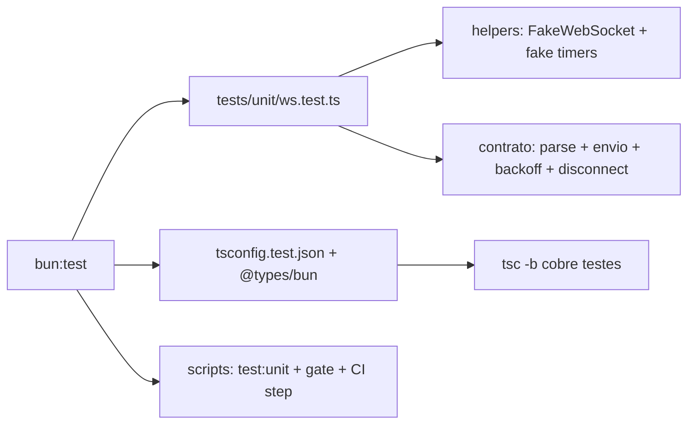

# Impl: I1 — Testes unitários para src/lib/ws.ts (protocolo zeroclaw.v1)

Status: aprovado
Atualizado em: 2026-08-18
Issue: #3
Intenção: body da Issue (sem plano de intenção — body é a spec)
Appetite restante: P2, escopo único de arquivo + config — sem corte necessário

## Leitura da intenção

- **Outcome:** `WsClient` coberto por testes unitários (reconexão com backoff,
  parse de frames, envio) para o contrato do protocolo `zeroclaw.v1` não
  regredir.
- **O que NÃO negociar:** sem mudança de semântica de protocolo (tipos de
  `src/lib/ws.ts` são contrato); zero servidor/estado novo (local-first).
- **O que reavaliar:** runner de testes, localização dos arquivos e estratégia
  de typecheck — o repo não tem runner unitário hoje (só Playwright e2e).

## Abordagem recomendada

**Opções consideradas:** A) bun:test + stubs de global | B) vitest com fake timers nativos | C) bun:test com timers reais
**Recomendação:** A — zero dependência de runtime, CI já roda bun, e os dois
stubs necessários (WebSocket e setTimeout) foram **verificados empiricamente**
neste ambiente (bun 1.3.14): `globalThis.WebSocket` é sobrescrevível e
`bun:test` **não** expõe `mock.timer` (probe falhou), então o fake timer é um
helper pequeno (~25 linhas) em vez de feature do runner.
**Rejeitadas:** B porque adiciona devDependency e roda sobre bun sem suporte
oficial (risco no CI host); C porque o backoff hardcoded vai a 30 s — testar o
cap exigiria espera real ou mudança de código de produção para injetar delay.

### Componentes / mudanças

- **`tests/unit/ws.test.ts`** (novo): suites por área — parse de frames,
  envio, reconexão com backoff, disconnect, status.
- **`tests/helpers/ws-test-utils.ts`** (novo): `FakeWebSocket` (constantes
  estáticas, `readyState`, captura de `url`/`protocols`, recorder de `send`,
  `close()` dispara `onclose` — espelha o browser) + `installFakeTimers()`
  (override de `globalThis.setTimeout`/`clearTimeout` com `advance()`;
  instala/restaura nos hooks).
- **`tsconfig.test.json`** (novo): project de testes, `lib: [ES2023, DOM]`,
  `types: ["bun"]`, referenciado no `tsconfig.json` raiz — `tsc -b` do build
  typechecka os testes sem contaminar o app. **Verificado** em probe: ws.ts +
  bun:test + DOM compilam sem conflito.
- **`package.json`**: devDependency `@types/bun`; script `"test:unit": "bun test tests/unit"`.
- **`package.json` gate**: `"gate": "lint && build && test:unit"` — o contrato
  passa a ser checado no gate local.
- **`.forgejo/workflows/ci.yml`**: step `Testes unitários` (`bun run test:unit`)
  entre Build e E2E.
- **Migration:** sem migration. **Access/Consent:** n/a (testes sem dados
  reais; nenhum token/URL real — só literais `ws://x`).

### Contrato testado (espelha `ws.ts` linha a linha)

- Parse: frame JSON → `onEvent` com o evento; frame não-JSON → ignorado sem
  throw; frame JSON de tipo desconhecido → repassado sem crash (semântica
  atual preservada).
- Envio: `sendMessage`/`sendApproval` (approve/deny/always) só com
  `readyState === OPEN`; fora disso `send` do socket não é chamado.
- Backoff: close não-intencional → `reconnecting` + novo socket após 1000 ms;
  delay dobra (1000 → 2000 → 4000…); cap em 30000; `onopen` reseta para 1000.
- Disconnect: intencional → `closed` sem reconnect; durante backoff → timer
  limpo, nenhum socket novo.
- Status: `connecting → open`, `connecting → reconnecting → open`.

## Fases verificáveis

1. **Scaffold** — `@types/bun`, `tsconfig.test.json` (+ ref no raiz),
   script `test:unit`, gate, CI step. Gate verde com teste placeholder.
2. **Helpers** — `ws-test-utils.ts` (FakeWebSocket + fake timers).
3. **Testes** — `tests/unit/ws.test.ts` (matriz acima). `bun run test:unit`
   verde; `bun run gate` verde.
4. **Fechamento** — /simplify no diff → débitos → PR `Closes #3` com auto-merge.

## Rabbit holes / Não escopo (engenharia)

- **Nada de refactor em `ws.ts`** para "testabilidade" (injeção de socket/delay
  em produção) — os stubs de global bastam; mexer em produção é risco de
  contrato sem ganho.
- **Sem mudança de semântica** para frames não-JSON / tipos desconhecidos.
- **Sem `--coverage`** e sem medição de % (não pedido; P2).
- **Fora de escopo:** `messages.ts`, `settings.ts`, `voice.ts`, componentes
  UI, e2e Playwright (já coberto no CI).
- Sem vitest/jsdom/novo tooling além de `@types/bun`.

## Riscos e mitigação

- `@types/bun` conflitar com lib DOM do app → tipos bun restritos ao
  `tsconfig.test.json`; conflito descartado por probe empírico.
- Fake timers vazarem entre testes → install/restore em `beforeEach`/
  `afterEach` do helper; teste do probe validou o padrão de override global.
- `bun test` não typechecka → o `tsconfig.test.json` no `tsc -b` cobre (erro de
  tipo em teste quebra o build, que é parte do gate).
- CI (runner host) sem `bun` → já usa `bun install`/`bunx playwright`; nada novo.

## Aceite de engenharia

- [x] Aceite de produto da intenção ainda coberto (WsClient: backoff, parse, envio)
- [x] Invariantes AGENTS/engineering-standards (zero servidor novo; sem token real em teste; copy pt-BR)
- [x] Testes de domínio previstos onde o contrato pode regredir (única mudança de código é teste/config)
