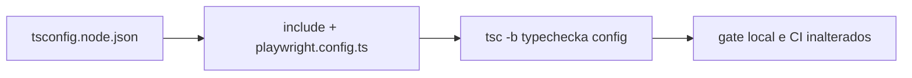

# Impl: I7 — Typecheck do playwright.config.ts (config fora do tsc -b)

Status: aprovado
Atualizado em: 2026-08-18
Issue: #7
Intenção: body da Issue (sem plano de intenção — body é a spec)
Appetite restante: P3, escopo de config — sem corte necessário

## Leitura da intenção

- **Outcome:** `playwright.config.ts` passa a ser typechecked pelo `tsc -b` do
  build — os dois arquivos de config raiz atuais (`vite.config.ts`,
  `playwright.config.ts`) ficam cobertos.
- **O que NÃO negociar:** sem mudança de runtime/stack; gate local e CI
  continuam iguais; e2e continua rodando só no CI.
- **O que reavaliar:** onde a config se encaixa — o body sugere "um projeto tsc"
  sem especificar qual; os projetos candidatos são `tsconfig.node.json`
  (vite.config.ts, node) e `tsconfig.test.json` (tests/unit + helpers, bun).

## Abordagem recomendada

**Opções consideradas:** A) incluir no `tsconfig.node.json` existente | B) novo
projeto `tsconfig.playwright.json` cobrindo config + `tests/e2e` | C) incluir
no `tsconfig.test.json`
**Recomendação:** A — a config roda em Node (não em bun), então o projeto
semanticamente certo é o de configs de node, que já é o do `vite.config.ts`
(`module: nodenext`, `types: ["node"]`). É 1 linha de include e foi
**verificado empiricamente** (tsc 6.0 com as flags do `tsconfig.node.json`:
`playwright.config.ts` compila limpo).
**Rejeitadas:** B porque adiciona um 4º projeto + reference no solution para
cobrir além do escopo relatado — os specs `tests/e2e` também compilam limpo
com as flags do node config, então o buraco residual é só 2 linhas de include;
vira débito rastreado no fechamento (decidir lá, não agora). C porque o
`tsconfig.test.json` é do mundo bun (`types: ["bun"]`, `lib: DOM`,
`moduleResolution: bundler`) — o runtime do Playwright é Node; contaminar o
projeto de testes com uma config de node mistura dois runtimes num projeto.

### Componentes / mudanças

- **`tsconfig.node.json`**: `"include": ["vite.config.ts", "playwright.config.ts"]`
  — nenhum outro arquivo/dependência muda.
- **Migration:** sem migration. **Access/Consent:** n/a (config sem dados).
- **UI:** n/a — sem mudança de produto.

## Fases verificáveis

1. **Config** — editar o include do `tsconfig.node.json` (1 linha).
2. **Gates** — `bun run build` (tsc -b) e `bun run gate` limpos; `tsc -b`
   recompila o projeto node incrementalmente (tsbuildinfo) — validar que o
   build inteiro continua green.

## Rabbit holes / Não escopo (engenharia)

- Typecheck de `tests/e2e/*.spec.ts` (mesma linha de include, barato de
  revisitar) — débito a triar no fechamento, não agora.
- Projeto tsc dedicado / `tsconfig.playwright.json` — cerimônia sem
  volatilidade para 1 arquivo.
- Mudar `module`/`moduleResolution` do `tsconfig.node.json` — quebraria o
  `vite.config.ts` sem ganho.

## Riscos e mitigação

- **Baixo:** o include novo só adiciona um arquivo ao projeto existente; se o
  Playwright trocar o shape do `defineConfig` no futuro, o erro aparece no
  build (comportamento desejado) e o fix é local à config.
- CI não roda e2e local: o typecheck da config passa a acontecer no `build`
  (CI e gate) em vez de só em runtime do Playwright — sem mudança de fluxo.

## Aceite de engenharia

- [x] Aceite de produto da intenção ainda coberto (config raiz typechecked)
- [x] Invariantes AGENTS/engineering-standards (zero mudança de runtime)
- [x] Testes de domínio previstos: n/a — change de tooling, verificação via
  `bun run build`/`bun run gate`
